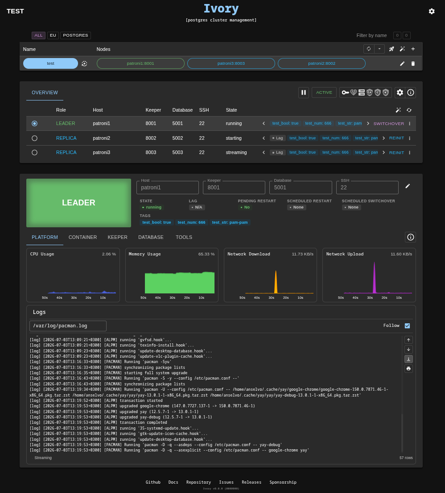

   

# Ivory

### [database cluster management tool]

   
   
   
   

 

Ivory is an open-source database cluster management tool built around the concept of a **Keeper** — a generic
management layer responsible for cluster manipulations. A Keeper can be a standalone agent running beside the 
database or a management system embedded directly in the database engine. As an example - [Patroni](https://patroni.readthedocs.io/)
the Keeper implementation for PostgreSQL.

It is designed for developers and DBAs who want a single UI to operate, troubleshoot, and deploy high-availability
database clusters — without dropping into the CLI for every task.

Ivory can run as a local tool on your laptop or as a shared service on a VM for team use.

---

  <h3>🌟 Support This Project! 🌟</h3>

If you found this project helpful, interesting, or inspiring, please consider giving it a **star** ⭐! Your support
helps:

✅ **Increase visibility** – More people can discover and benefit from this project.  
✅ **Boost motivation** – It encourages us to keep improving and adding new features.  
✅ **Show appreciation** – A small gesture that means a lot to open-source creators!

Thank you for being part of this journey! 🚀

---

### Vision: Beyond Postgres

Ivory started as a Postgres/Patroni tool. We're working towards a more pluggable architecture, where support for other
databases and HA tools could be added as a plugin, instead of being baked into the core. v2 is the first step of that
rework:

| Version |                                                                                                                                                                                                                                                                                                                                                                                                                                                              |
|---------|--------------------------------------------------------------------------------------------------------------------------------------------------------------------------------------------------------------------------------------------------------------------------------------------------------------------------------------------------------------------------------------------------------------------------------------------------------------|
| **v1**  | Hard-wired to Patroni and Postgres, with Postgres-centric node management and no mobile support.                                                                                                                                                                                                                                                                                                                                                             |
| **v2**  | Pluggable Keeper and database engines — the goal is to manage different databases by implementing a simple plugin for each, instead of baking their behaviour into the core. Node management is now VM-centric, with nodes modeled as Hardware + Software behind a generic Platform abstraction (on-prem Docker over SSH today, Kubernetes/OpenShift planned). The UI is now mobile friendly, so you can check on and operate your clusters from your phone. |

---

## Features

**Deployment**

- [Deploying a cluster](.doc/deployment.md#deploying-a-cluster) — over SSH, with no orchestrator or agent
- [Deploying a single cluster node](.doc/deployment.md#deploying-a-single-cluster-node) — add or rebuild one node of an existing cluster
- [Deployment templates](.doc/deployment.md) — the command that runs on each node, saved and reusable
- [Default templates](.doc/deployment.md#default-templates) — ready to deploy for every supported database, in two variants:
    - **Multi host** — one node per machine, the usual layout for a real cluster
    - **Single host** — the whole cluster on one machine, for trying it out locally or on a test VM

**Cluster management**

- [Cluster list](.doc/clusters.md) — register manually, auto-detect from one address, or deploy
- [Cluster health](.doc/overview.md) — node roles, replication lag, pending restarts, warnings
- [HA operations](.doc/overview.md#ha-operations) — switchover, failover, reinitialise, restart, reload, pause
- [Database configuration](.doc/node.md#configuration) — view and patch settings per node

**Node operations**

- [Container lifecycle](.doc/node.md#container) — deploy, start, stop, restart, remove, logs
- [Keeper operations per node](.doc/node.md#keeper) — the same HA actions in a full-page view
- [VM metrics](.doc/node.md#system) — CPU, memory, network and processes on the host
- [Log streaming](.doc/node.md#logs) — any file on the host, or container output

**Database troubleshooting**

- [Query builder](.doc/node.md#database) — saved SQL queries for monitoring and diagnostics
- [Database tools](.doc/node.md#tools) — engine-specific maintenance tools, run as background jobs with live output:
    - **Postgres** — [pgcompacttable](.doc/pg_compacttable.md), reduces table and index bloat without heavy locks

---

## Get started

1. Start the docker container
    - **v1 (latest)**
        - 🐳 **Docker Hub** `docker run -p 80:80 --restart always veegres/ivory`
        - 📦 **GitHub Container registry** `docker run -p 80:80 --restart always ghcr.io/veegres/ivory`
    - **v2 (alpha)** — check the
      [Releases page](https://github.com/veegres/ivory/releases) for the current tag
        - 🐳 **Docker Hub** `docker run -p 80:80 --restart always veegres/ivory:v2.0.0-alpha.1`
        - 📦 **GitHub Container registry** `docker run -p 80:80 --restart always ghcr.io/veegres/ivory:v2.0.0-alpha.1`
2. Go to http://localhost:80
3. Complete the initial setup wizard (authentication, secret key)
4. Add your first cluster — **manual** (all node addresses), **auto-detect** (one address, Ivory
   finds the rest), or **[deploy](.doc/deployment.md)** a new one from a template
5. Start monitoring

---

### Supported Keepers

| Keeper                                     | Database   | Stage  | Why                                                                                                                                                                  |
|--------------------------------------------|------------|--------|----------------------------------------------------------------------------------------------------------------------------------------------------------------------|
| [Patroni](https://patroni.readthedocs.io/) | Postgres   | STABLE | The Keeper Ivory was originally built around                                                                                                                         |
| Postgres                                   | Postgres   | BETA   | Not everyone needs HA — sometimes you just want to manage a plain Postgres                                                                                           |
| ETCD                                       | ETCD       | ALPHA  | Patroni relies on etcd as a DCS, so managing it directly made sense too                                                                                              |
| Redis                                      | Redis      | ALPHA  | A widely used cache/store that often sits right next to the databases Ivory already manages                                                                          |
| ClickHouse                                 | ClickHouse | ALPHA  | A popular analytics database and a natural next step for Ivory's plugin set                                                                                          |
| ZooKeeper                                  | ZooKeeper  | ALPHA  | ClickHouse needs real ZooKeeper protocol, not etcd, to coordinate replication — deployable as its own ensemble and usable as the external DCS other keepers point at |
| MongoDB                                    | MongoDB    | ALPHA  | A widely used document store with its own native replica-set HA, a natural fit next to Ivory's other native (non-orchestrated) keepers                               |

P.S. these particular databases weren't picked from a grand roadmap — they're mainly what the maintainer runs day to
day, and Ivory exists to simplify that routine first. Broader support grows from there.

---

## FAQ

### How to update to a new version?

Ivory now provides Backup/Restore functionality for migrating your data between versions. You can backup your
configuration (clusters, queries, permissions) from the Settings page and restore it in a new version. The backup format
is backward compatible and designed to work across different versions.

Alternatively, you can mount the data directory between containers (see instructions below), though this approach
typically works only for patch releases. For minor and major version updates, always check the
[backward compatibility page](SECURITY.md) and prefer using the Backup/Restore feature for safer migration.

### How Ivory stores the data?

All Ivory data is located inside `/opt/ivory/data` directory. Ivory has a docker volume, it means that you won't lose it
if your container is going to be rebooted. But you need to consider mounting this directory to your local disk if you
want to save the data between different containers
`--mount type=bind,source=YOUR_LOCAL_PATH,target=/opt/ivory/data`, or you can mount volume of the old container to the
new one by docker flag `--volumes-from`

### How to use authentication?

Ivory can work with or without authentication. It will ask you to configure it during the initial setup. Ivory supports
multiple authentication methods:

- **Basic** - Simple username and password authentication
- **LDAP** - Integration with LDAP directories
- **OIDC/SSO** - Single Sign-On via OpenID Connect

You can safely provide your secrets to Ivory for SSO and LDAP configuration. Ivory encrypts all secrets using your
secret word. Therefore, make sure to select the appropriate application configuration in your SSO provider. As well,
Ivory requires the _profile_ or _email_ scopes from the SSO provider in order to retrieve user information.

Additionally, Ivory includes a comprehensive permission system that allows you to control access at a granular level
(view/manage clusters, execute queries, manage configurations, etc.). You can manage user permissions from the Settings
page after authentication is enabled.

Usually you don't want to use authentication when working with Ivory locally, but it is recommended when deploying it in
shared environments or VMs.

### How to run Ivory under a sub path?

Ivory offers a special environment variable, `IVORY_URL_PATH`, designed for use when running the service behind a
reverse proxy under a sub-path. It's important to note that the path must start with a leading slash, such as `/ivory`.
Example: `docker run -p 80:80 -env IVORY_URL_PATH=/ivory --restart always veegres/ivory`

### How to run Ivory under TLS?

You need to specify two environment variables `IVORY_CERT_FILE_PATH` and `IVORY_CERT_KEY_FILE_PATH`. Because it is a
docker environment, you need to mount these files first and then provide these variables with paths. Recommended path
inside container is `/opt/certs`. Note that Ivory changes port to 443 when you have provided both paths. Example: `docker run -p 443:443 --mount type=bind,source=YOUR_CERTS_PATH,target=/opt/certs
--env IVORY_CERT_FILE_PATH=/opt/certs/YOUR_CERT_NAME.crt --env IVORY_CERT_KEY_FILE_PATH=/opt/certs/YOUR_KEY_NAME.key
--restart always veegres/ivory`

## Contribution

If you're interested in contributing to the Ivory project, consider these options:

- [Enhancements](https://github.com/veegres/ivory/issues)
- [Good for newcomers](https://github.com/veegres/ivory/issues?q=is%3Aissue+is%3Aopen+label%3A%22good+first+issue%22)
- [Supported versions](SECURITY.md)
- [Setup Local Environment](.docker/ivory-dev/README.md)
- [Build Frontend](app/README.md)
- [Build Backend](server/README.md)
