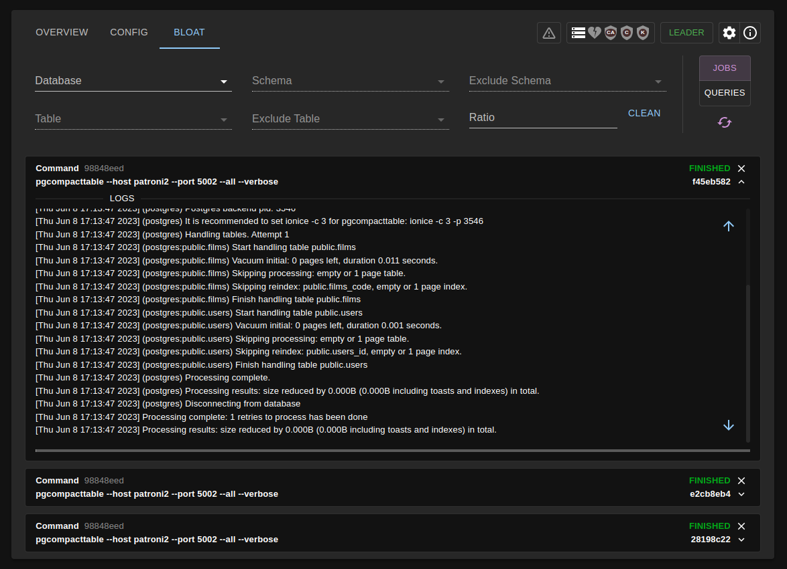
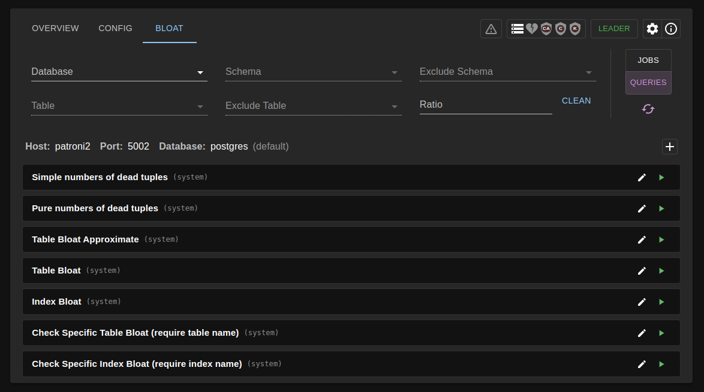

# [☰](../README.md) Bloat

Bloat tab can help you to check your postgres bloat and run bloat cleaning. Bloat cleaning can
be executed only on the leader instance, Ivory detects leader automatically and sets it as default. 
Cleaning and queries will be run on the main instance. You can change main instance in overview settings 
(top-right corner).

Bloat cleaning is provided by [pgcompacttable](https://github.com/dataegret/pgcompacttable) tool.
You can check specific job logs and the command by which it was executed in the job list below the main form.

On the right side you can move to queries tab, where you can check some queries that will help you monitor bloat.
If you want to change db in which query will be run you can change it above (both clean & bloat queries are able to work with this field).

P.S. more queries to troubleshoot you can find in [instance block](instance.md)
