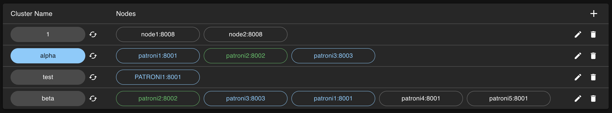

# [☰](../README.md) Clusters

This is the main view of all clusters that you have added. 
You can add cluster manually or by auto-detection (button on the left side near add/plus).
As well, you can edit or remove your clusters. Here you have brief overview which instances in cluster is a leader or a replica. 
If you want to operate or check more information about the cluster you need to check some of them by clicking on cluster name.

Above the main block you can see tags by checking them you will filter clusters by assigned tags. In the right said there is
warning mark with number of problematic clusters.

