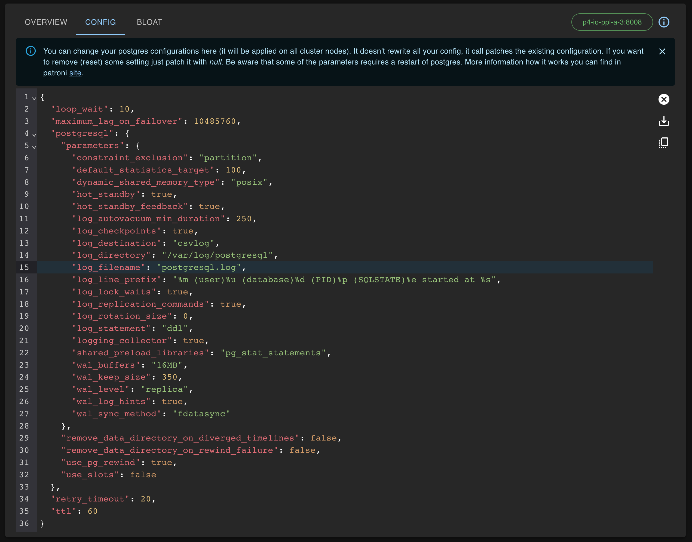

# [☰](../README.md) Config

Config tab allows you to change your postgres configurations (it will be applied on all cluster nodes).
It doesn't rewrite all your config, it calls patches the existing configuration.
If you want to remove (reset) some setting just patch it with `null`. 
Be aware that some of the parameters requires a restart of postgres. 
More information how it works you can find in patroni [site](https://patroni.readthedocs.io/en/latest/SETTINGS.html).

