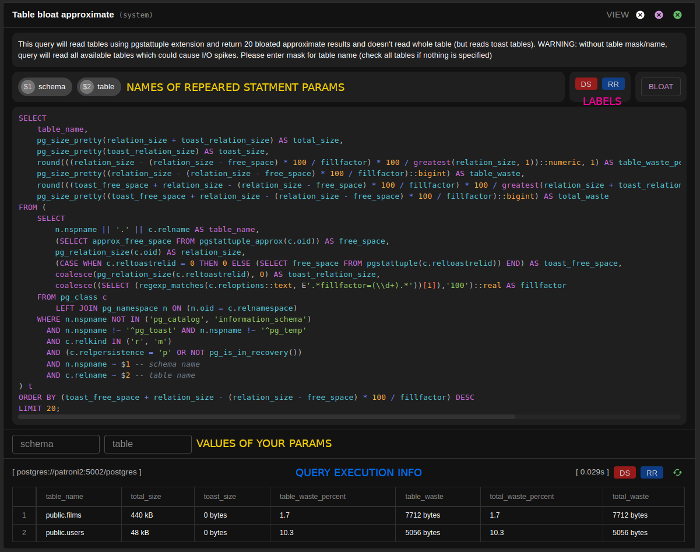

# [☰](../README.md) Instance

In instance block you can check information about particular instance. It mostly works
with postgres itself, sending some request to postgres to monitor and troubleshoot it.

### Chart

In __Chart__ tab you can see some simple charts with information like database uptime, number of 
databases, connections and it sizes.

### Query Builder

In __Queries__ tab you can run some queries that will help you to troubleshoot postgres. If you have
configured _Manual queries_ when you started postgres, you will be able to create your own queries and
edit system queries to fit your needs. But it can be dangerous, because Ivory executes any query like 
UPDATE / INSERT / DELETE and you will be able to fetch any data. That is why sometimes it is good to restrict
such usage (by default it is configured as disabled).

#### Queries builder also support such feature as:
- **Prepared statement** - you can simply provide request with *$1*, *$2*, etc., specify name
  parameters for them and Ivory will add values of these parameters to the query.
- **Response history** - clicking on the log button you can find last query executions.
- **Restore query** - it restores query to initial state.
- **Mark query** You can mark some query by 3 labels to not mess up:
   - *database sensitive* - give you info that it should be sent to direct database and response has variety
   - *master only* - this query can be executed only in the master instance
   - *replica recommended* - when query is too complicated and can consume a lot of resource

