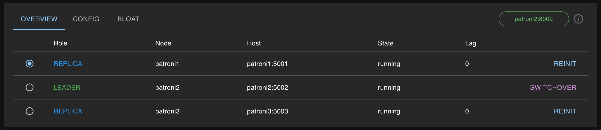
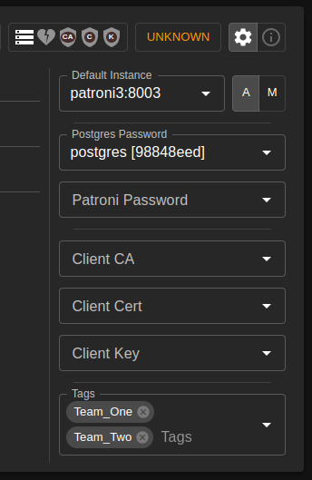

# [☰](../README.md) Overview

Overview can help you to check if your cluster is ok, do reinit and switchover.
You can click on specific instance, and it will allow you to troubleshoot direct instance.

### Cluster Options

In the top right corner you can find icons that help to understand what configurations
for this particular cluster you have set up.

You can change set up by clicking on the settings button and change there some cluster 
options like postgres password, patroni password, tags and certificates to connect to 
patroni if patroni configured with certificate usage.

Main instance is a specific instance to which Ivory sends request. Automatically
it is always try to choose master as a main instance. If you want you can always change it
here.

